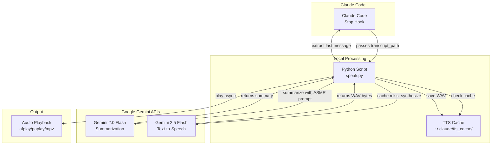

# Claude Code TTS Hook

ASMR-style text-to-speech hook for Claude Code that reads the last assistant message using Google Gemini.

## Architecture



## Description

When a Claude Code session stops, this hook:
1. Extracts the last assistant message from the transcript
2. Summarizes it with ASMR-friendly phrasing using Gemini Flash
3. Converts to speech using Gemini's TTS with the "Aoede" voice
4. Caches results to avoid re-synthesizing identical texts
5. Plays audio asynchronously

Perfect for getting a gentle, non-intrusive summary of what was accomplished during your coding session.

## Requirements

- Python 3.7+
- `GEMINI_API_KEY` environment variable set with a valid Google Generative AI API key
- macOS (afplay), Linux (paplay/aplay/mpv), or compatible audio player

## Installation

### 1. Clone or download this repository

```bash
git clone https://github.com/serejaris/claude-code-tts.git
# or copy the files manually
```

### 2. Set up your API key

```bash
export GEMINI_API_KEY="your-api-key-here"
```

For permanent setup, add to your shell config (`~/.zshrc`, `~/.bashrc`, etc.):

```bash
export GEMINI_API_KEY="your-api-key-here"
```

### 3. Configure Claude Code

Add to `~/.claude/settings.json`:

```json
{
  "hooks": {
    "on_stop": [
      {
        "type": "command",
        "command": "python3 /path/to/claude-code-tts-hook/speak.py",
        "stdin": "json",
        "timeout": 120
      }
    ]
  }
}
```

Replace `/path/to/claude-code-tts-hook` with the actual path where you installed the hook.

## Available Voices

The hook uses the "Aoede" voice by default (calm, gentle ASMR-friendly). You can change the `VOICE` variable in `speak.py` to any of these:

- **Aoede** (default) - Calm and gentle
- **Puck** - Bright and playful
- **Kore** - Warm and friendly
- **Charon** - Deep and thoughtful
- **Fenrir** - Strong and confident
- **Leda** - Soft and soothing
- **Orus** - Clear and crisp
- **Zephyr** - Light and breezy

Edit the `VOICE` variable at the top of `speak.py`:

```python
VOICE = "Aoede"  # Change to any voice above
```

## Caching

Synthesized audio is cached in `~/.claude/tts_cache/` using MD5 hashes of the text and voice name. This means:

- Identical summaries are never synthesized twice
- Cache persists across sessions
- Each voice has separate cache entries
- No automatic cleanup (safe to delete `~/.claude/tts_cache/` anytime)

## How It Works

### Transcript Format

The hook reads JSONL-formatted transcript files where each line contains:

```json
{"type": "assistant", "message": {"content": [{"type": "text", "text": "..."}]}}
```

### ASMR Summarization

The hook uses Gemini Flash to transform technical messages into gentle ASMR-style summaries:

**Input:** "Fixed the authentication bug in auth.py line 42, updated config files"
**Output:** "Fixed the auth bug for you... config is updated"

The summarization preserves meaning while removing technical details and file paths for a more natural reading experience.

### Audio Playback

Playback runs asynchronously in a new process, so Claude Code continues immediately without waiting for the audio to finish.

## Troubleshooting

### "Summary error" or "TTS error" in stderr

These are non-fatal errors that fall back gracefully:
- Missing API key → no audio produced
- Network timeout → truncated summary or original text
- API errors → logs to stderr, script continues

### Audio not playing

Check that your system has one of the supported audio players:
- macOS: `afplay` (built-in)
- Linux: `paplay` (PulseAudio), `aplay` (ALSA), or `mpv` (install via package manager)

### Cache issues

Clear cache and retry:

```bash
rm -rf ~/.claude/tts_cache/
```

## Environment Variables

- `GEMINI_API_KEY` (required) - Your Google Generative AI API key
- `VOICE` (optional, via speak.py) - Voice name for TTS

## License

MIT
