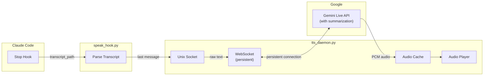

# Claude Code TTS Hook

🇷🇺 [Русская версия](README_RU.md)

ASMR-style text-to-speech for Claude Code using Google Gemini Live API with **minimal latency (~100ms)**.

## Architecture



## Why Daemon?

**Without daemon (REST API):** ~2-3 seconds latency
- HTTP connection setup
- TLS handshake
- API authentication
- Response processing

**With daemon (WebSocket):** ~100ms latency
- Persistent connection (no handshake)
- Instant audio streaming
- Aggressive caching

## Quick Start

### 1. Install dependency

```bash
pip install google-genai
```

### 2. Set API key

```bash
export GEMINI_API_KEY="your-api-key"
# Add to ~/.zshrc or ~/.bashrc for persistence
```

### 3. Install files

```bash
# Clone repository
git clone https://github.com/serejaris/claude-code-tts.git
cd claude-code-tts

# Copy to Claude hooks directory
mkdir -p ~/.claude/hooks
cp tts_daemon.py speak_hook.py ~/.claude/hooks/
chmod +x ~/.claude/hooks/*.py

# Copy config (optional, defaults work fine)
cp tts_config.example.json ~/.claude/tts_config.json
```

### 4. Configure Claude Code

Add to `~/.claude/settings.json`:

```json
{
  "hooks": {
    "Stop": [{
      "hooks": [{
        "type": "command",
        "command": "python3 ~/.claude/hooks/speak_hook.py",
        "timeout": 15
      }]
    }]
  }
}
```

### 5. Start daemon

```bash
python3 ~/.claude/hooks/tts_daemon.py
```

For auto-start, add to `~/.zshrc`:

```bash
# Start TTS daemon if not running
(pgrep -f tts_daemon.py > /dev/null || nohup python3 ~/.claude/hooks/tts_daemon.py > /dev/null 2>&1 &) 2>/dev/null
```

## Testing

```bash
# Test daemon directly
echo "Hello, this is a test" | nc -U ~/.claude/tts.sock

# Check daemon status
pgrep -f tts_daemon.py

# View logs
tail -f ~/.claude/tts_daemon.log

# Stop daemon
pkill -f tts_daemon.py
```

## Files

| File | Purpose |
|------|---------|
| `tts_daemon.py` | Background daemon with persistent WebSocket to Gemini Live API |
| `speak_hook.py` | Claude Code hook that parses transcript and sends to daemon |
| `speak.py` | Standalone version (no daemon, higher latency) |

## Configuration

Create `~/.claude/tts_config.json` (or copy from `tts_config.example.json`):

```json
{
  "mode": "summary",
  "voice": "Aoede",
  "style": "asmr",
  "language": "russian",
  "max_chars": 1000,
  "custom_styles": {}
}
```

**Changes apply immediately** — no daemon restart needed.

### Modes

| Mode | Behavior |
|------|----------|
| `summary` | Summarizes in 1-2 sentences (default) |
| `full` | Reads text as-is |

### Voices

| Voice | Character |
|-------|-----------|
| **Aoede** (default) | Calm, gentle |
| Kore | Warm, friendly |
| Puck | Bright, playful |
| Charon | Deep, thoughtful |
| Fenrir | Strong, confident |
| Leda | Soft, soothing |
| Orus | Clear, crisp |
| Zephyr | Light, breezy |

### Styles

| Style | Behavior |
|-------|----------|
| `asmr` | Soft, gentle, with calm pauses (default) |
| `neutral` | Natural and clear |
| `energetic` | With energy and enthusiasm |

Custom styles:
```json
{
  "custom_styles": {
    "mentor": "Speak like a wise mentor, calm and thoughtful"
  }
}
```
Then use: `"style": "mentor"`

### Languages

| Language | Key |
|----------|-----|
| Russian | `russian` (default) |
| English | `english` |
| German | `german` |
| Spanish | `spanish` |
| French | `french` |
| Chinese | `chinese` |
| Japanese | `japanese` |

### Paths

```
~/.claude/
├── hooks/
│   ├── tts_daemon.py      # Daemon
│   └── speak_hook.py      # Hook
├── tts_config.json        # Configuration (create from example)
├── tts_cache/             # Cached audio files
├── tts.sock               # Unix socket
├── tts_daemon.pid         # Daemon PID
└── tts_daemon.log         # Daemon logs
```

## How It Works

1. **Claude Code stops** → triggers Stop hook
2. **speak_hook.py** reads transcript, extracts last assistant message
3. Raw text sent to daemon via Unix socket (max 1000 chars)
4. **tts_daemon.py** sends to Gemini Live API via persistent WebSocket
5. **Live API** summarizes via system_instruction and synthesizes audio in single request
6. Audio cached and played asynchronously

## Debugging

### Enable debug logging

Run daemon with `--debug` flag to see detailed logs in console:

```bash
python3 ~/.claude/hooks/tts_daemon.py --debug
```

### What logs show

Debug logs include:

- **API responses:** Type of each response from Gemini API, presence of `server_content`
- **model_turn details:** Number of parts in each turn from the model
- **Audio chunks:** Size in bytes of each audio chunk received
- **Turn completion:** When response collection is complete, total chunk count
- **Empty chunks warning:** Alert when no audio was synthesized for input text

Example debug output:
```
2025-12-14 10:15:23 [DEBUG] API response: GenerateContentResponse, has_server_content=True
2025-12-14 10:15:23 [DEBUG] model_turn: 2 parts
2025-12-14 10:15:23 [DEBUG] Audio chunk: 4096 bytes
2025-12-14 10:15:23 [DEBUG] Audio chunk: 3840 bytes
2025-12-14 10:15:23 [DEBUG] Turn complete, total chunks: 2
```

### Log file location

```bash
tail -f ~/.claude/tts_daemon.log
```

All events (INFO, WARNING, ERROR) are always logged to file, regardless of `--debug` flag.

## Troubleshooting

### Daemon not starting

```bash
# Check if already running
pgrep -f tts_daemon.py

# Check logs
cat ~/.claude/tts_daemon.log

# Remove stale socket/pid
rm -f ~/.claude/tts.sock ~/.claude/tts_daemon.pid
```

### No audio

- macOS: `afplay` is built-in
- Linux: Install `pulseaudio-utils` (for `paplay`) or `mpv`

```bash
# Linux
sudo apt install pulseaudio-utils
# or
sudo apt install mpv
```

### Socket connection refused

Daemon might have crashed. Restart it:

```bash
pkill -f tts_daemon.py
python3 ~/.claude/hooks/tts_daemon.py
```

### Clear cache

```bash
rm -rf ~/.claude/tts_cache/
```

## Standalone Mode

If you prefer simpler setup without daemon (with higher latency), use `speak.py`:

```json
{
  "hooks": {
    "Stop": [{
      "hooks": [{
        "type": "command",
        "command": "python3 /path/to/speak.py",
        "timeout": 60
      }]
    }]
  }
}
```

## Requirements

- Python 3.8+
- `google-genai` package
- `GEMINI_API_KEY` environment variable
- Audio player: `afplay` (macOS) or `paplay`/`mpv` (Linux)

## License

MIT
