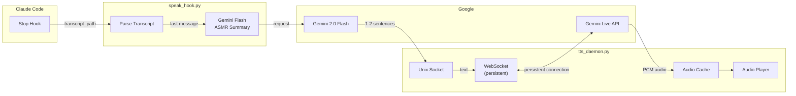

# Claude Code TTS Hook

🇷🇺 [Русская версия](README_RU.md)

ASMR-style text-to-speech for Claude Code using Google Gemini Live API with **minimal latency (~100ms)**.

## Architecture



## Why Daemon?

**Without daemon (REST API):** ~2-3 seconds latency
- HTTP connection setup
- TLS handshake
- API authentication
- Response processing

**With daemon (WebSocket):** ~100ms latency
- Persistent connection (no handshake)
- Instant audio streaming
- Aggressive caching

## Quick Start

### 1. Install dependency

```bash
pip install google-genai
```

### 2. Set API key

```bash
export GEMINI_API_KEY="your-api-key"
# Add to ~/.zshrc or ~/.bashrc for persistence
```

### 3. Install files

```bash
# Clone repository
git clone https://github.com/serejaris/claude-code-tts.git
cd claude-code-tts

# Copy to Claude hooks directory
mkdir -p ~/.claude/hooks
cp tts_daemon.py speak_hook.py ~/.claude/hooks/
chmod +x ~/.claude/hooks/*.py
```

### 4. Configure Claude Code

Add to `~/.claude/settings.json`:

```json
{
  "hooks": {
    "Stop": [{
      "hooks": [{
        "type": "command",
        "command": "python3 ~/.claude/hooks/speak_hook.py",
        "timeout": 15
      }]
    }]
  }
}
```

### 5. Start daemon

```bash
python3 ~/.claude/hooks/tts_daemon.py
```

For auto-start, add to `~/.zshrc`:

```bash
# Start TTS daemon if not running
(pgrep -f tts_daemon.py > /dev/null || nohup python3 ~/.claude/hooks/tts_daemon.py > /dev/null 2>&1 &) 2>/dev/null
```

## Testing

```bash
# Test daemon directly
echo "Hello, this is a test" | nc -U ~/.claude/tts.sock

# Check daemon status
pgrep -f tts_daemon.py

# View logs
tail -f ~/.claude/tts_daemon.log

# Stop daemon
pkill -f tts_daemon.py
```

## Files

| File | Purpose |
|------|---------|
| `tts_daemon.py` | Background daemon with persistent WebSocket to Gemini Live API |
| `speak_hook.py` | Claude Code hook that parses transcript and sends to daemon |
| `speak.py` | Standalone version (no daemon, higher latency) |

## Configuration

### Voices

Edit `VOICE` in `tts_daemon.py`:

| Voice | Character |
|-------|-----------|
| **Aoede** (default) | Calm, gentle |
| Kore | Warm, friendly |
| Puck | Bright, playful |
| Charon | Deep, thoughtful |
| Fenrir | Strong, confident |
| Leda | Soft, soothing |
| Orus | Clear, crisp |
| Zephyr | Light, breezy |

### Paths

```
~/.claude/
├── hooks/
│   ├── tts_daemon.py      # Daemon
│   └── speak_hook.py      # Hook
├── tts_cache/             # Cached audio files
├── tts.sock               # Unix socket
├── tts_daemon.pid         # Daemon PID
└── tts_daemon.log         # Daemon logs
```

## How It Works

1. **Claude Code stops** → triggers Stop hook
2. **speak_hook.py** reads transcript, extracts last assistant message
3. **Gemini Flash** summarizes to 1-2 ASMR-style sentences
4. Summary sent to daemon via Unix socket
5. **tts_daemon.py** synthesizes via persistent WebSocket
6. Audio cached and played asynchronously

## Troubleshooting

### Daemon not starting

```bash
# Check if already running
pgrep -f tts_daemon.py

# Check logs
cat ~/.claude/tts_daemon.log

# Remove stale socket/pid
rm -f ~/.claude/tts.sock ~/.claude/tts_daemon.pid
```

### No audio

- macOS: `afplay` is built-in
- Linux: Install `pulseaudio-utils` (for `paplay`) or `mpv`

```bash
# Linux
sudo apt install pulseaudio-utils
# or
sudo apt install mpv
```

### Socket connection refused

Daemon might have crashed. Restart it:

```bash
pkill -f tts_daemon.py
python3 ~/.claude/hooks/tts_daemon.py
```

### Clear cache

```bash
rm -rf ~/.claude/tts_cache/
```

## Standalone Mode

If you prefer simpler setup without daemon (with higher latency), use `speak.py`:

```json
{
  "hooks": {
    "Stop": [{
      "hooks": [{
        "type": "command",
        "command": "python3 /path/to/speak.py",
        "timeout": 60
      }]
    }]
  }
}
```

## Requirements

- Python 3.8+
- `google-genai` package
- `GEMINI_API_KEY` environment variable
- Audio player: `afplay` (macOS) or `paplay`/`mpv` (Linux)

## License

MIT
