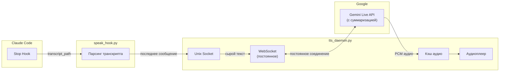

🇬🇧 [English version](README.md)

# Claude Code TTS Hook

ASMR-стиль синтез речи для Claude Code с использованием Google Gemini Live API и **минимальной задержкой (~100ms)**.

## Архитектура



## Почему Daemon?

**Без daemon (REST API):** ~2-3 секунды задержки
- Установка HTTP соединения
- TLS handshake
- API аутентификация
- Обработка ответа

**С daemon (WebSocket):** ~100ms задержки
- Постоянное соединение (без handshake)
- Мгновенный стриминг аудио
- Агрессивное кэширование

## Быстрый старт

### 1. Установи зависимость

```bash
pip install google-genai
```

### 2. Установи API ключ

```bash
export GEMINI_API_KEY="твой-api-ключ"
# Добавь в ~/.zshrc или ~/.bashrc для постоянного использования
```

### 3. Установи файлы

```bash
# Клонируй репозиторий
git clone https://github.com/serejaris/claude-code-tts.git
cd claude-code-tts

# Скопируй в директорию хуков Claude
mkdir -p ~/.claude/hooks
cp tts_daemon.py speak_hook.py ~/.claude/hooks/
chmod +x ~/.claude/hooks/*.py
```

### 4. Настрой Claude Code

Добавь в `~/.claude/settings.json`:

```json
{
  "hooks": {
    "Stop": [{
      "hooks": [{
        "type": "command",
        "command": "python3 ~/.claude/hooks/speak_hook.py",
        "timeout": 15
      }]
    }]
  }
}
```

### 5. Запусти daemon

```bash
python3 ~/.claude/hooks/tts_daemon.py
```

Для автозапуска добавь в `~/.zshrc`:

```bash
# Запуск TTS daemon если не запущен
(pgrep -f tts_daemon.py > /dev/null || nohup python3 ~/.claude/hooks/tts_daemon.py > /dev/null 2>&1 &) 2>/dev/null
```

## Тестирование

```bash
# Тест daemon напрямую
echo "Привет, это тест" | nc -U ~/.claude/tts.sock

# Проверить статус daemon
pgrep -f tts_daemon.py

# Посмотреть логи
tail -f ~/.claude/tts_daemon.log

# Остановить daemon
pkill -f tts_daemon.py
```

## Файлы

| Файл | Назначение |
|------|------------|
| `tts_daemon.py` | Фоновый daemon с постоянным WebSocket к Gemini Live API |
| `speak_hook.py` | Хук Claude Code, парсит транскрипт и отправляет в daemon |
| `speak.py` | Standalone версия (без daemon, выше задержка) |

## Настройка

### Голоса

Измени `VOICE` в `tts_daemon.py`:

| Голос | Характер |
|-------|----------|
| **Aoede** (по умолчанию) | Спокойный, нежный |
| Kore | Тёплый, дружелюбный |
| Puck | Яркий, игривый |
| Charon | Глубокий, задумчивый |
| Fenrir | Сильный, уверенный |
| Leda | Мягкий, успокаивающий |
| Orus | Чёткий, отчётливый |
| Zephyr | Лёгкий, свежий |

### Пути

```
~/.claude/
├── hooks/
│   ├── tts_daemon.py      # Daemon
│   └── speak_hook.py      # Хук
├── tts_cache/             # Кэш аудио файлов
├── tts.sock               # Unix socket
├── tts_daemon.pid         # PID daemon
└── tts_daemon.log         # Логи daemon
```

## Как это работает

1. **Claude Code останавливается** → срабатывает Stop hook
2. **speak_hook.py** читает транскрипт, извлекает последнее сообщение ассистента
3. Сырой текст отправляется в daemon через Unix socket (макс 1000 символов)
4. **tts_daemon.py** отправляет в Gemini Live API через постоянный WebSocket
5. **Live API** суммаризирует через system_instruction и синтезирует аудио в одном запросе
6. Аудио кэшируется и воспроизводится асинхронно

## Решение проблем

### Daemon не запускается

```bash
# Проверь, не запущен ли уже
pgrep -f tts_daemon.py

# Проверь логи
cat ~/.claude/tts_daemon.log

# Удали устаревший socket/pid
rm -f ~/.claude/tts.sock ~/.claude/tts_daemon.pid
```

### Нет звука

- macOS: `afplay` встроен
- Linux: Установи `pulseaudio-utils` (для `paplay`) или `mpv`

```bash
# Linux
sudo apt install pulseaudio-utils
# или
sudo apt install mpv
```

### Socket connection refused

Daemon мог упасть. Перезапусти его:

```bash
pkill -f tts_daemon.py
python3 ~/.claude/hooks/tts_daemon.py
```

### Очистить кэш

```bash
rm -rf ~/.claude/tts_cache/
```

## Standalone режим

Если предпочитаешь простую настройку без daemon (с большей задержкой), используй `speak.py`:

```json
{
  "hooks": {
    "Stop": [{
      "hooks": [{
        "type": "command",
        "command": "python3 /path/to/speak.py",
        "timeout": 60
      }]
    }]
  }
}
```

## Требования

- Python 3.8+
- Пакет `google-genai`
- Переменная окружения `GEMINI_API_KEY`
- Аудиоплеер: `afplay` (macOS) или `paplay`/`mpv` (Linux)

## Лицензия

MIT
