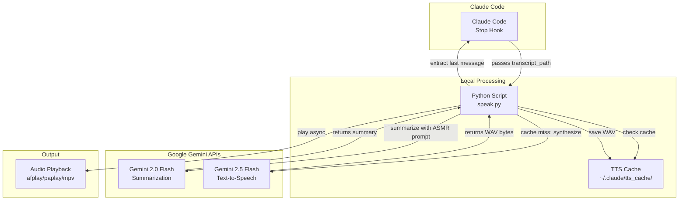

🇬🇧 [English version](README.md)

# Claude Code TTS Hook

ASMR-стиль синтез текста в речь для Claude Code, читающий последнее сообщение ассистента с помощью Google Gemini.

## Архитектура



## Описание

Когда сессия Claude Code завершается, этот хук:
1. Извлекает последнее сообщение ассистента из транскрипта
2. Резюмирует его с ASMR-дружественным форматированием с помощью Gemini Flash
3. Преобразует в речь с использованием Gemini TTS с голосом "Aoede"
4. Кэширует результаты, чтобы избежать повторного синтеза одинакового текста
5. Воспроизводит аудио асинхронно

Идеально подходит для получения нежного, неинтрузивного резюме того, что было сделано во время вашей сессии кодирования.

## Требования

- Python 3.7+
- Переменная окружения `GEMINI_API_KEY` с действительным ключом API Google Generative AI
- macOS (afplay), Linux (paplay/aplay/mpv) или совместимый аудиоплеер

## Установка

### 1. Клонируй или скачай этот репозиторий

```bash
git clone https://github.com/serejaris/claude-code-tts.git
# или скопируй файлы вручную
```

### 2. Установи API ключ

```bash
export GEMINI_API_KEY="your-api-key-here"
```

Для постоянной установки добавь в конфиг оболочки (`~/.zshrc`, `~/.bashrc` и т.д.):

```bash
export GEMINI_API_KEY="your-api-key-here"
```

### 3. Настрой Claude Code

Добавь в `~/.claude/settings.json`:

```json
{
  "hooks": {
    "on_stop": [
      {
        "type": "command",
        "command": "python3 /path/to/claude-code-tts-hook/speak.py",
        "stdin": "json",
        "timeout": 120
      }
    ]
  }
}
```

Замени `/path/to/claude-code-tts-hook` на реальный путь, где ты установил хук.

## Доступные голоса

Хук использует голос "Aoede" по умолчанию (спокойный, нежный, ASMR-дружественный). Ты можешь изменить переменную `VOICE` в `speak.py` на любой из этих:

- **Aoede** (по умолчанию) - Спокойный и нежный
- **Puck** - Яркий и игривый
- **Kore** - Теплый и дружелюбный
- **Charon** - Глубокий и задумчивый
- **Fenrir** - Сильный и уверенный
- **Leda** - Мягкий и успокаивающий
- **Orus** - Четкий и отчетливый
- **Zephyr** - Легкий и свежий

Отредактируй переменную `VOICE` в начале `speak.py`:

```python
VOICE = "Aoede"  # Измени на любой голос выше
```

## Кэширование

Синтезированное аудио кэшируется в `~/.claude/tts_cache/` с использованием MD5 хеша текста и имени голоса. Это означает:

- Идентичные резюме никогда не синтезируются дважды
- Кэш сохраняется между сессиями
- Каждый голос имеет отдельные записи кэша
- Автоматическая очистка отсутствует (безопасно удалить `~/.claude/tts_cache/` в любой момент)

## Как это работает

### Формат транскрипта

Хук читает JSONL-форматированные файлы транскрипта, где каждая строка содержит:

```json
{"type": "assistant", "message": {"content": [{"type": "text", "text": "..."}]}}
```

### ASMR резюмирование

Хук использует Gemini Flash для трансформации технических сообщений в нежные ASMR-стиль резюме:

**Входные данные:** "Fixed the authentication bug in auth.py line 42, updated config files"
**Выходные данные:** "Fixed the auth bug for you... config is updated"

Резюмирование сохраняет смысл, убирая технические детали и пути файлов для более естественного восприятия при чтении.

### Воспроизведение аудио

Воспроизведение работает асинхронно в новом процессе, поэтому Claude Code продолжает работу сразу же, не ожидая завершения воспроизведения аудио.

## Решение проблем

### "Summary error" или "TTS error" в stderr

Это некритичные ошибки, которые корректно обрабатываются:
- Отсутствует API ключ → аудио не создается
- Таймаут сети → сокращенное резюме или исходный текст
- Ошибки API → логируется в stderr, скрипт продолжает работу

### Аудио не воспроизводится

Проверь, что в системе установлен один из поддерживаемых аудиоплееров:
- macOS: `afplay` (встроенный)
- Linux: `paplay` (PulseAudio), `aplay` (ALSA), или `mpv` (установить через package manager)

### Проблемы с кэшем

Очисти кэш и повтори попытку:

```bash
rm -rf ~/.claude/tts_cache/
```

## Переменные окружения

- `GEMINI_API_KEY` (требуется) - Твой ключ API Google Generative AI
- `VOICE` (опционально, через speak.py) - Имя голоса для TTS

## Лицензия

MIT
